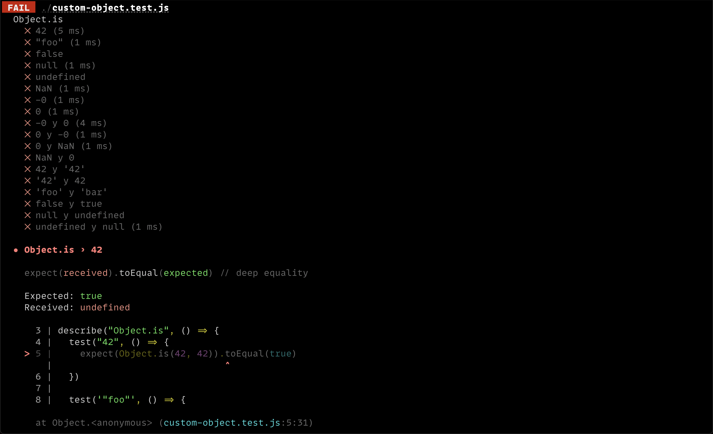

# Lección 01: Tipos Primitivos

# 🐾 Primeros pasos

En JavaScript **NO** todo es un objeto. Conocer los tipos primitivos de JavaScript nos ayuda a entender y aprovecharlos de su naturaleza dinámica, para poder solucionar y resolver problemas de una manera más eficiente y con bases claras. Nosotros podemos crear programas sin tener mucha idea sobre éstos tipos, el problema es cuando nos encontramos errores y no podamos resolverlos de una manera sencilla o correcta.

📜 Fundamental leer sobre los Tipos Primitivos en [Aprendamos Sobre los Tipos de Datos Primitivos en JavaScript](https://escuelafrontend.com/articulos/los-tipos-primitivos-en-javascript).

### 🏋️‍♂️Ejercicios

En este Ejercicio, crearemos la simple funcion `sum()`.

## Configuración de la lección

Es requerido tener instalado una versión de `node` superior a `15.x`. Puedes instalarla [directamente](https://docs.npmjs.com/downloading-and-installing-node-js-and-npm) o puedes cambiar a una version igual o mayour [usando nvm](https://github.com/nvm-sh/nvm#installing-and-updating).

```bash
git clone <REPO>
cd leccion02
npm install
```

Para poder empezar con el ejercicio, necesitas ejecutar el siguiente comando:

```bash
npm run test:w
```

Verás un montón de tests fallidos en la consola:



Ahora puedes abrir el archivo [`./sum.js`](sum.js) y empezar a implementar la funcion `sum` siguiento las siguientes instrucciones
## Instrucciones


### 🍬 Crédito Extra


## 📣 Feedback

Por favor completa [este formulario](https://docs.google.com/forms/d/e/1FAIpQLSf6hxzKdcgkQv6EKjS1AXmGO_Y49Aa86zOpcveI3Xp-ZIHYTg/viewform?usp=pp_url&entry.1972342453={{MI-EMAIL}}&entry.1828471740=leccion-01)

---
**Agradecimientos**

El ejercicio que hemos hecho en esta lección fue traducido del curso "Deep JavaScript Foundations, v3" de [Kyle Simpson](https://github.com/getify) que puedes encontrar en [Frontend Masters](https://frontendmasters.com/courses/deep-javascript-v3/). Kyle me ha dado concentimiento para usar su mismo ejercicio!
