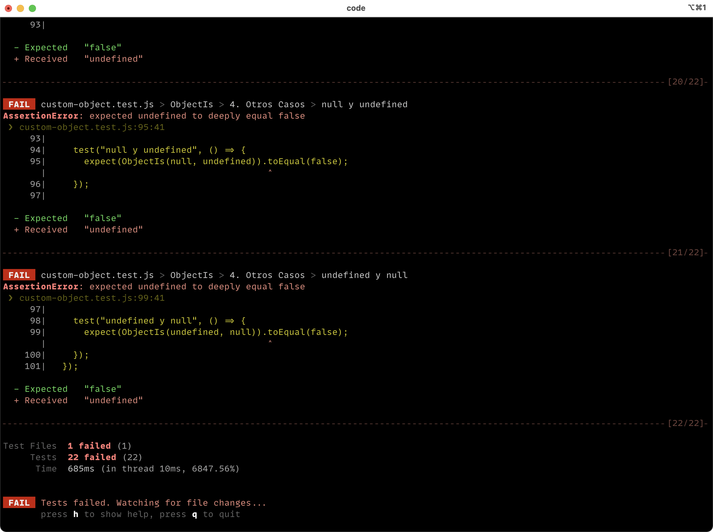

# Lección 02: Igualdad

# 🐾 Primeros pasos


📜 Fundamental leer sobre Igualdad en JavaScript [TODO agregar articulo!]().

### 🏋️‍♂️Ejercicios

En este Ejercicio, definiremos nuestra propia versión de la función `Object.is()`.

## Configuración de la lección

Es requerido tener instalado una versión de `node` superior a `15.x`. Puedes instalarla [directamente](https://docs.npmjs.com/downloading-and-installing-node-js-and-npm) o puedes cambiar a una version igual o mayour [usando nvm](https://github.com/nvm-sh/nvm#installing-and-updating).

```bash
git clone <REPO>
cd leccion01
npm install
```

Para poder empezar con el ejercicio, necesitas ejecutar el siguiente comando:

```bash
npm run test:w
```

Verás un montón de tests fallidos en la consola:



Ahora puedes abrir el archivo [`./custom-object.js`](custom-object.js) y empezar a implementar la funcion `Object.is` siguiento las siguientes instrucciones
## Instrucciones

- [ ] 1. `Object.is(..)` debe aceptar dos parametros.

- [ ] 2. Debe devolver `true` si los parametros pasados son "estrictamente iguales" (no solamente `===`, sigue leyendo las otras instrucciones!), o `false` si son estrictamente iguales.

- [ ] 3. Para `NaN`, puedes usar la función `Number.isNaN()`

- [ ] 4. Para `-0`, lastimosamente no hay ninguna función nativa disponible, pero te dejo una pista para comprobarlo bien: `-Infinity`.

- [ ] 5. Si los parámetros son de cualquier otro tipo, entonces podemos comprobar si igualdad de maneda estricta (`===`).

- [ ] 6. No puedes usar el método por defecto `Object.is()`, **No hagas trampas**!

### 🍬 Crédito Extra

1. Intenta comprobar `NaN` sin usar la función `Number.isNaN()`, ¿Cómo lo harías?

## 📣 Feedback

Por favor completa [este formulario](https://docs.google.com/forms/d/e/1FAIpQLSf6hxzKdcgkQv6EKjS1AXmGO_Y49Aa86zOpcveI3Xp-ZIHYTg/viewform?usp=pp_url&entry.1972342453={{MI-EMAIL}}&entry.1828471740=leccion-01)

---
**Agradecimientos**

El ejercicio que hemos hecho en esta lección fue traducido del curso "Deep JavaScript Foundations, v3" de [Kyle Simpson](https://github.com/getify) que puedes encontrar en [Frontend Masters](https://frontendmasters.com/courses/deep-javascript-v3/). Kyle me ha dado concentimiento para usar su mismo ejercicio!
