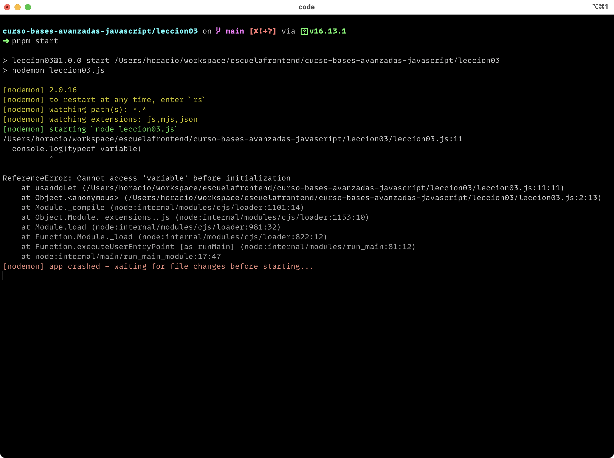

# Lección 03: Block Scoping con let y const

## 🐾 Primeros pasos

Aprender sobre los ámbitos en JavaScript nos ayuda a "pensar" como los sistemas que ejecutan nuestro código, ayudándonos a entender mejor el proceso y encontrar soluciones a errores y problemas fácilmente y más rápido. Ser más conscientes de estos conceptos nos ayuda tambien a tomar mejores decisiones sobre cómo organizar y modelar nuestro código.

## 🎯Objetivos

El programa que ejecutaremos a continuación tiene errores. El objetivo es resolver estos problemas con la ayuda de los conocimientos obtenidos sobre los ámbitos, let y const.

## 🏋️‍♂️Ejercicios

En este ejercicio, Tienes que resolver los problemas que tienen las funciones dentro del archivo [`leccion03.js`](leccion03.js) y explicar con tus palabras porqué ocurren.

## Configuración de la lección

Es requerido tener instalado una versión de `node` superior a `15.x`. Puedes instalarla [directamente](https://docs.npmjs.com/downloading-and-installing-node-js-and-npm) o puedes cambiar a una version igual o mayour [usando nvm](https://github.com/nvm-sh/nvm#installing-and-updating).

Debes instalar [pnpm] para que tengas menos problemas ejecutando los ejercicios. Puedes seguir los pasos para instalarlo en tu sistema [aquí](https://pnpm.io/installation)

```bash
git clone <REPO>
cd leccion03
pnpm install
```

Para poder empezar con el ejercicio, necesitas ejecutar el siguiente comando:

```bash
pnpm start
```

Verás unos errores en la consola:



Ahora puedes abrir el archivo [`./leccion03.js`](leccion03.js) y empezar a resolver las siguientes instrucciones.

## Instrucciones

- [ ] 1. ¿Por qué el siguiente código al ejecutarlo da un error?
- [ ] 2. ¿Habrá alguna diferencia si cambiamos de `let` a `const`?
- [ ] 3. Si descomentamos `usuario = 'foo'`, veremos un error, ¿A qué se debe?
- [ ] 4. pero `usuario.dispositivos.push({name: 'macbook pro'})` NO produce un error. Puedes explicar porqué pasa esto?

## 🍬 Crédito Extra

- [ ] 5. Asegúrate de que en la consola puedas ver todos los valores al ejecutar la función
- [ ] 6. ¿Qué puedes hacer para que `usuario.dispositivos.push({name: 'macbook pro'})` no se pueda hacer?

## 📣 Feedback

Por favor completa [este formulario](https://docs.google.com/forms/d/e/1FAIpQLSf6hxzKdcgkQv6EKjS1AXmGO_Y49Aa86zOpcveI3Xp-ZIHYTg/viewform?usp=pp_url&entry.1972342453={{MI-EMAIL}}&entry.1828471740=leccion-03)
